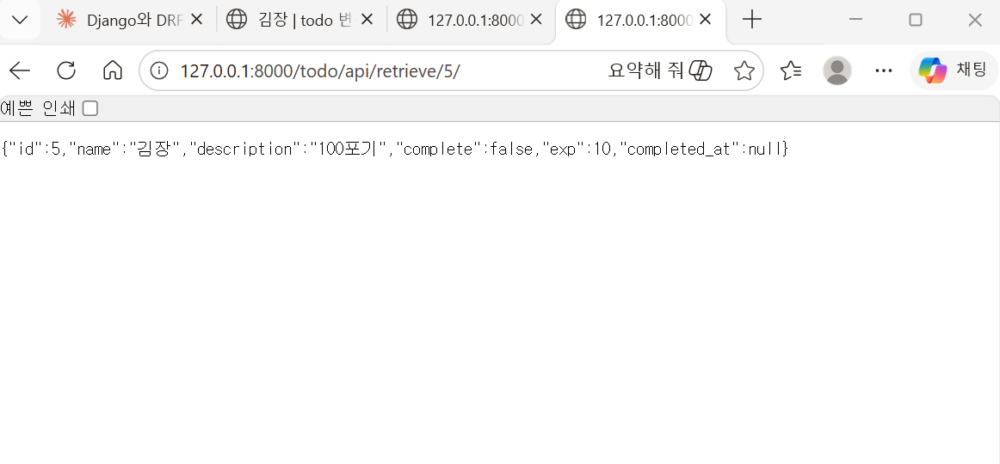

# 🚀 todoList_Django_to_DRF

이 프로젝트는 Django 기반 Todo 애플리케이션을 시작으로
Django REST Framework, JWT 인증, PostgreSQL 전환,
AI 모델 연동(Hugging Face), Redis/Celery 비동기 처리까지
단계적으로 확장하는 풀스택 학습 프로젝트입니다.

---

## 📌 프로젝트 목표

- Django MVT 구조 이해
- DRF 기반 API 설계
- 인증(JWT) 시스템 구축
- 데이터베이스 전환(SQLite → PostgreSQL)
- 외부 데이터 수집 및 적재
- AI 모델 연동
- Redis/Celery 기반 비동기 처리
- 실무형 프로젝트 구조 설계

---

## 🧭 전체 개발 로드맵

### 1️⃣ Django 기본 세팅
- 가상환경 설정 (uv)
- pre-commit 설정 (black, isort, flake8)
- Todo CRUD 구현

### 2️⃣ Generic View 기반 CRUD
- CBV 기반 구조 설계
- Django Template 렌더링

### 3️⃣ DRF ViewSets로 API 전환
- Serializer 설계
- API 응답 구조 설계

### 4️⃣ 환경 변수 설정 (.env)

### 5️⃣ Pagination 추가

### 6️⃣ 이미지 업로드 기능 추가

### 7️⃣ 회원가입 / 로그인 기능 구현

### 8️⃣ 템플릿 구조 정리

### 9️⃣ JWT 인증 도입

### 🔟 인터랙티브 기능 추가 (Ajax / Axios)

### 1️⃣1️⃣ CSS 및 UI 정리

### 1️⃣2️⃣ 다른 사용자 글 조회 기능

### 1️⃣3️⃣ SQLite → PostgreSQL 전환

### 1️⃣4️⃣ 웹 크롤링 → CSV / JSONL 데이터 정제

### 1️⃣5️⃣ DBeaver → DRF 데이터 적재

### 1️⃣6️⃣ DRF에 Hugging Face 모델 연동

### 1️⃣8️⃣ Redis + Celery 비동기 처리 및 캐시 적용

---

## 🛠 사용 기술

### Backend
- Python
- Django
- Django REST Framework
- Django ORM
- JWT (SimpleJWT)

### Database
- SQLite3 (개발 초기)
- PostgreSQL (확장 단계)

### AI / Data
- Hugging Face
- Pandas
- CSV / JSONL 데이터 처리

### Async / Cache
- Redis
- Celery

### Frontend
- Django Template
- HTML5 / CSS3
- JavaScript
- Axios

### DevOps
- Git / GitHub
- pre-commit
- Docker (예정)
- AWS EC2 (예정)

---

## 📂 프로젝트 구조

DRF_todoList
├── mysite/ # Django 프로젝트 설정
├── todo/ # Todo 앱
├── templates/
├── static/
├── manage.py
├── requirements.txt
└── .pre-commit-config.yaml


---

## ⚙ 실행 방법

```bash
uv venv
source .venv/bin/activate
uv pip install -r requirements.txt

python manage.py migrate
python manage.py runserver

---

## 📈 확장 방향

- REST API 기반 프론트엔드 분리
- Docker 기반 배포
- CI/CD 구성
- AI 추천 기능 확장
- 모니터링 시스템(Prometheus/Grafana)


---

## 🎯 프로젝트 성격

이 프로젝트는 단순 Todo 앱이 아닌
"실무 확장형 Django → DRF → AI → 비동기 구조 학습 프로젝트"입니다.
<<<<<<< Updated upstream


=======




>>>>>>> Stashed changes
